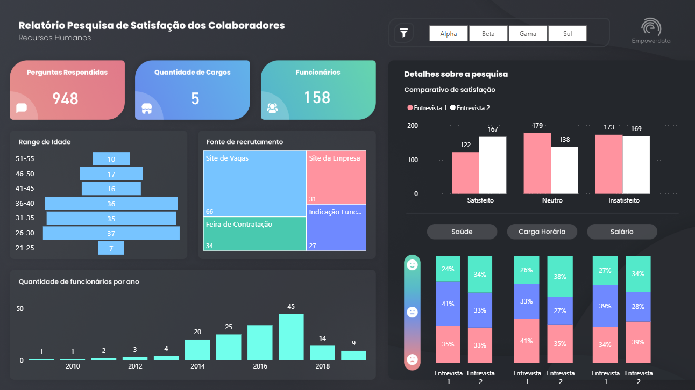

# 👥 Dashboard de Pesquisa de Satisfação dos Colaboradores

Dashboard desenvolvido durante o curso de Power BI (8h) da **Empowerdata**, com foco em prática de modelagem de dados, DAX e visualização de indicadores de RH.

## 📋 Sobre o projeto

Painel de análise de uma pesquisa de satisfação interna, cruzando dados demográficos, fonte de recrutamento e níveis de satisfação por categoria (saúde, carga horária, salário).

### Principais indicadores

- Total de perguntas respondidas, cargos e funcionários
- Distribuição por faixa etária
- Fonte de recrutamento (site de vagas, indicação, feira, site da empresa)
- Comparativo de satisfação entre duas rodadas de entrevista
- Nível de satisfação por categoria (saúde, carga horária, salário)
- Evolução da quantidade de funcionários por ano
- Filtros por unidade (Alpha, Beta, Gama, Sul)

## 🛠️ Ferramentas utilizadas

- **Power BI** — modelagem, DAX e visualização
- Tema escuro customizado

## 🖼️ Screenshot

## 📌 Contexto

Projeto desenvolvido para fins de aprendizado, como parte do curso de Power BI da Empowerdata. Serviu de base prática para os projetos autorais do meu portfólio.

## 👤 Autor

João Gabriel Machado da Rosa
[LinkedIn](https://linkedin.com/in/o-joao-machado)
