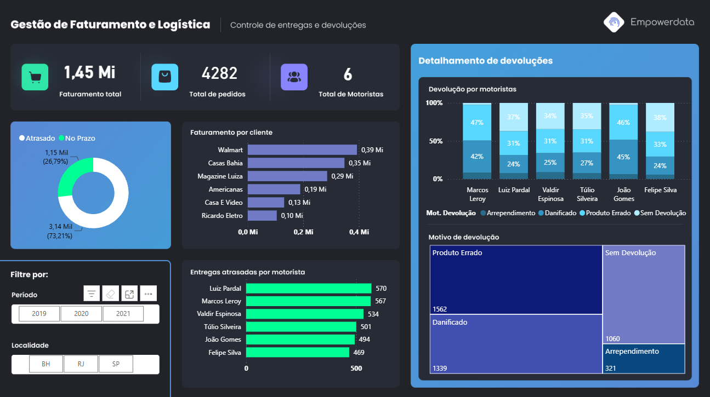

# 📦 Dashboard de Gestão de Faturamento e Logística

Dashboard desenvolvido durante o curso de Power BI (8h) da **Empowerdata**, com foco em prática de modelagem de dados, DAX e storytelling visual.

## 📋 Sobre o projeto

Painel de controle de entregas e devoluções, com indicadores de faturamento, pedidos, performance de motoristas e motivos de devolução.

### Principais indicadores

- Faturamento total e total de pedidos
- Proporção de entregas atrasadas vs. no prazo
- Faturamento por cliente (Walmart, Casas Bahia, Magazine Luiza, etc.)
- Entregas atrasadas por motorista
- Detalhamento de devoluções por motorista e motivo (produto errado, danificado, arrependimento)
- Filtros por período (2019-2021) e localidade (BH, RJ, SP)

## 🛠️ Ferramentas utilizadas

- **Power BI** — modelagem, DAX e visualização
- Tema escuro customizado

## 🖼️ Screenshot

## 📌 Contexto

Projeto desenvolvido para fins de aprendizado, como parte do curso de Power BI da Empowerdata. Serviu de base prática para os projetos autorais do meu portfólio.

## 👤 Autor

João Gabriel Machado da Rosa
[LinkedIn](https://linkedin.com/in/o-joao-machado)
